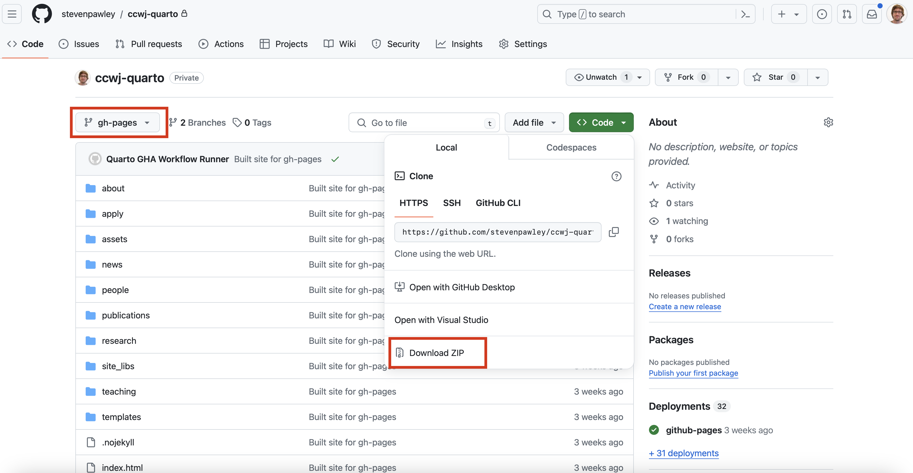
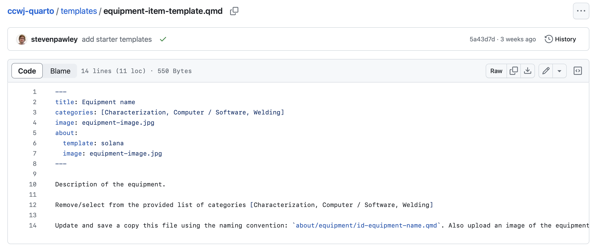
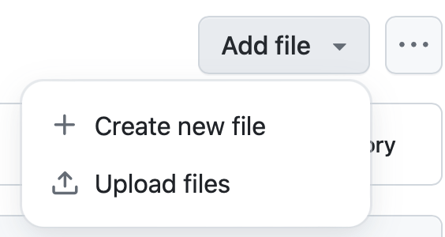

<!-- badges: start -->

<!-- badges: end -->

## Overview

The CCWJ website is based on the [Quarto](https://quarto.org) framework, which is a lightweight, flexible, and extensible static site generator for academic websites. The website is hosted on GitHub Pages and is automatically built and deployed using GitHub Actions.

## Rendering/rebuilding the website

Changes and rebuilding/rendering of the website are triggered by pushing changes to the `main` branch of the repository. The website is built using the `quarto` command-line tool, which is installed in the GitHub Actions environment. The website is built using the `quarto site build` command, which generates the website in the `_site` folder.

## Deploying the rendered website

The contents of the `_site` folder are automatically copied to the `gh-pages` branch of the repository, which is used by GitHub Pages to serve the website at . The GitHub Pages deployment can be used to preview any changes that have been made to the website.

The website can also be deployed to any other web server that supports static sites. To deploy the website to another web server, you can download the repository content from the `gh_pages` branch, and then upload it to any other web server, e.g., the `https://sites.ualberta.ca`, using any method you prefer (e.g., FTP, SCP, etc.), or using a GUI tool like [WinSCP](https://winscp.net/eng/download.php) etc.

## Adding / Updating Website Content

The Quarto project has been setup to make use of [document listings](https://quarto.org/docs/websites/website-listings.html) for the components of the website that are most likely to change on a regular basis. These components relate to the following website sections:

-   About (Facilities (equipment) sub page)
-   People (staff, PhD Students, MSc Students, BSc Students, Alumn, Alumn UG, Alumn Visitor sub pages)
-   Research (Projects sub page)
-   Teaching
-   News

Templates that can be used to add new content to these sections are stored within the `templates` folder in the project's root directory.

Additionally, the publications are generated dynamically from the Bibtex file that is stored as `publications/references.bib`. Only the 'Articles', 'Proceedings' and 'Reports' are generated dynamically. The books and theses are generated manually using template files because for books, each entry requires an image of the book, and for these, relatively few items are present which are easily managed.

Simple changes to the website can be made directly through the GitHub interface by creating, editing, or deleting files from the respective directories (and/or uploading new image files). For more substantial changes, it is recommended to clone the repository from GitHub and then commit the changes, but this requires familiarity with Git.

Alternatively, a complete version of this repository is also available on [Posit Cloud](https://posit.cloud/spaces/417662/join?access_code=E9OvQn6lI_mMg9VazqLy6zOqBYd4_wN1DSE0a0Nw), which is an online development environment, which can be used for editing and previewing the website content without needing to install any software. Changes to the website can be made directly in the Posit Cloud environment, and then the changes can be committed to the GitHub repository.

### Detailed Instructions

For all of the listing document based pages, anything in the associated `.qmd` files can be altered freely without causing any breaking changes to the website, but it is important the keep the header structure the same. An example of a header is:

---
title: My name
image: CCWJID - My name.jpg
subtitle: Course that you are enrolled in
about:
  template: solana
  image: CCWJID - My name.jpg
  links:
    - icon: email
      text: my-email@ualberta.ca
      href: mailto:my-email@ualberta.ca
    - icon: linkedin
      text: my-linkedin-id
      href: https://www.linkedin.com/in/my-linkedin-id
---

In this example, any of the values can be updated (e.g, the name, the email address etc.), but the overall structure and field names needs to be kept the same.

#### About \> Facilities

The equipment items in the About \> Facilities section are automatically generated from files within the `about/equipment` folder. Each item needs a plain text markdown file and an associated image, for example the 'Creaform MetraScan 750 3D Scanner' item has two files - `3DSC-creaform-metrascan-750.qmd` and `3DSC-creaform-metrascan-750.jpg`. You can remove any item from the equipment listing page by deleting these two files for any particular item.

To add a new equipment item through the GitHub web interface, copy the text from the `templates/equipment-item-template.qmd` to the clipboard, or just download the individual file from GitHub.

Then rename the template and edit the text (using any text editor, like notepad etc.) and then upload the new file to the `about/equipment` folder along with an image of the equipment (using the same filename that you specify in the updated version of the template file).

{width="200"}

#### People \> PhD Students, MSc Students ...

Similar to equipment items, CCWJ member sub pages are automatically generated from files within one of the `people/phds`, `people/mscs`, `people/staff`, etc. folders. Each member has a plain text markdown with their biography and an accompanying image file. To add new members, the examples in the `templates/ccwj-member-about-page.qmd` can be used as a starting point. This file can be downloaded, renamed and edited in a text editor, and uploaded along with a portrait photo to the appropriate `people/staff(phds, mscs, bscs, alumn, alumn-ug, alumn-vistors)` subdirectory.

#### Research \> Projects

The research projects are also listing documents. An entry for a new project can use the `templates/project-template.qmd` as a starting point. The projects page displays the logo of the granting organization. Images for these are found in the `research/projects/granting-logos` directory, so unless the granting organization is new, these images can be reused for new projects.

#### Research \> Talks

For talks that were recorded, new items can be added to the Research \> Talks page by using the `templates/talks-template.qmd`. In addition to updating the required fields, this file needs to be altered depending on where the video is stored - either on YouTube or in Google Drive, which changes how the video is embedded. Instructions are provided in the template and you can delete the other embedding method. Each talk also needs an image to show in the listing page. This image can just be a screenshot of the recording, or the opening slide etc.

#### Teaching

The teaching page uses the document listing mechanism for each individual course. Any course files in the `teaching/courses` directory will automatically be added to the teaching page. A template for a course page is included in the `templates/course-template.qmd` file. Anything in the template can be changed when creating a new course, but the header structure needs to remain the same. The current template is structured as:

-   Introduction
-   Link to syllabus document hosted in Google Drive
-   Link to opening lecture hosting in Google Drive
-   Course materials table (a series of rows and columns)

Any of these sections can be removed if desired.

Each course `.qmd` document needs to have an associated image that appears on the teaching page.

#### News

A template for a new news item is present in `templates/news-article-template.qmd`. Because most news items are going to link to some external site, it is not necessary to also upload an image, rather, the image shown in each news article is just a hyperlink to an image on an external site. However, this can be replaced with an manually uploaded image, if desired.

#### Publications

The publications listings are automatically regenerated from the bibtex files in the "/publications" folder. These bibtex files have to be exported as \*plain bibtex", not using other extensions like "Better Bibtex". This is because these extensions insert lots of special escaping characters, for example, double curly braces, that prevent software from changing the case of the titles and authors. These extensions also escape special characters like accents. However, the code in this repository reads the bibtex files 'as-is', so it is important to export them as plain bibtex.

Some entries contained missing items, particularly DOIs, which have been completed in the repository version of the `publications/references.bib`. To add new publications, you can download this file, add new entries to it, and upload it back to the same location (overwriting the file). Alternatively, a new Bibtex file can exported from some other reference manager such as Zotero or Refworks, assuming that the citations are complete.
