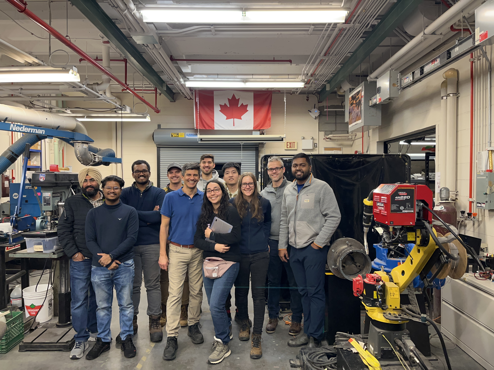
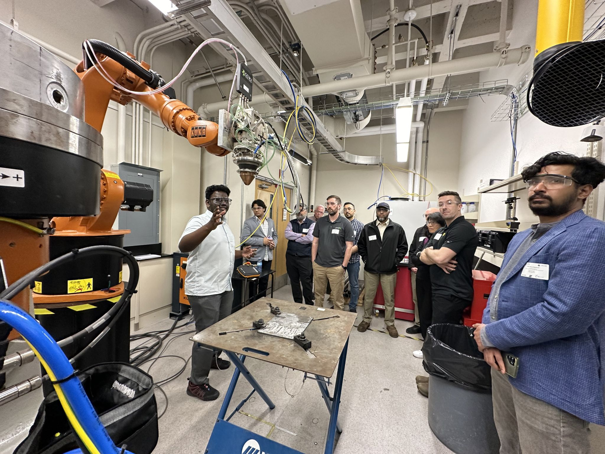
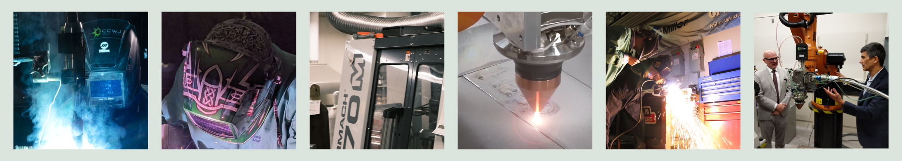
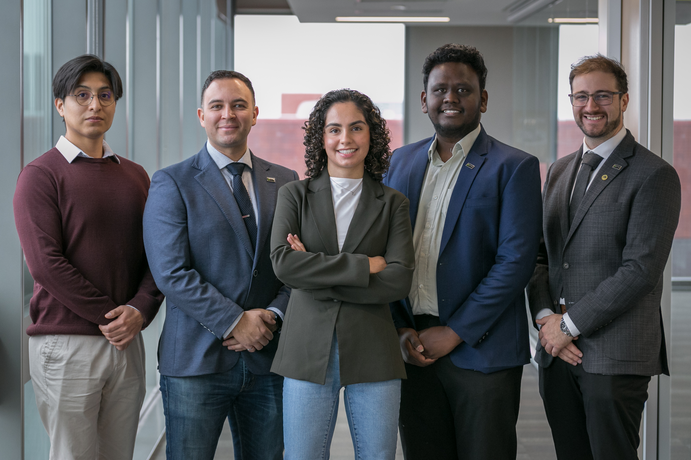

## Our Research Centre

::: {layout="[60,40]"}
:::{.div}
The Canadian Centre for Welding and Joining (CCWJ) is one of the world's largest university initiatives in welding with a global reputation reflected in multiple awards, such as the “Image of Welding Award” awarded by the American Welding Society as a leading education institution in 2013.

The CCWJ’s $5.5M facility houses all forms of arc welding, a 9 kW laser, and several robots. Diagnostic tools include high speed cameras, laser lighting, a specialized thermal camera, wavelength spectrometer, and data acquisition. Characterization capabilities include hardness mapping, surface profilometry, instrumented impact, hydrogen, oxygen, and nitrogen testing, dilatometry, and metallography. Centralized facilities at the UofA also provide access to high end electron microscopy and composition analysis tools. Tools of analysis at the CCWJ include latest generation weld modeling software such as VRWeld, Simufact, and Transweld, and general purpose modeling software such as Comsol and Matlab. Materials properties software includes ThermoCalc and JMatPro.

:::
{fig-align="right"}
:::

## Working with Industry

::: {.highlight-row}
::: {layout="[35,65]"}

The CCWJ has a long track record of working with industry. All the projects are industry oriented, and nearly all are funded by industry. Distinguishing traits of the CCWJ are the highly selected students, world-class facilities, ability to use fundamentals concepts to explain observable phenomena, a culture of collaboration and love of our work, a vast network of contacts worldwide, and strong brand recognition. The Weldco/Industry Chair in Welding and Joining was created in 2007 at the request and with the support of industry. After a worldwide search, Prof. Patricio Mendez came to the University of Alberta in 2009 as the inaugural Chair. The CCWJ Laboratory opened on May 5, 2010 with significant contributions of equipment from Lincoln Electric and Miller Electric. The Alberta Metal Fabrication Innovation program (AMFI) was created on Jan 1, 2011 in partnership between the Canadian Centre for Welding and Joining and Alberta Innovates, with support from Western Economic Diversification and the Government of Alberta.
:::
:::

 AMFI is a unique company development opportunity designed specifically for the Alberta metal manufacturing and fabrication sector. The Program provides innovation and improvement opportunities for sector companies and stakeholders. Participants gain access to both production and business enhancement expertise, developed and provided by some of Alberta’s top research, technology development and process improvement institutions. In 2018, the CCWJ received over $1M from Western Economic Diversification to launch a project in advanced manufacturing system capable of performing automated repairs together with several industry partners, and contributions support from KUKA Canada and Octopuz. 

 
::: {layout="[75, 25]"}

The newest initiative is the [Canadian Cluster for Laser and ADvanced Manufacturing (C:CLAD)](https://www.canada.ca/en/prairies-economic-development/news/2024/08/minister-boissonnault-announces-federal-investments-to-commercialize-innovative-alberta-technologies.html), a pan-Canadian initiative with numerous industry partners and international collaborators. C:CLAD will combine resources to market Alberta as a region of excellence, and make it a global destination for advanced manufacturing including laser cladding, laser heat treatment, plasma-transferred arc, and advanced automation / digital technologies, servicing industries including oil and gas, mining, agriculture, aerospace, renewable energy, nuclear, and heavy machinery.

{width="160px" fig-align="center"}
:::

## Weldco/Industry Chair in Welding and Joining

::: {.highlight-row}

{width="100%"}

The Weldco/Industry Endowment was signed in 2008 with the goal to establish the Canadian Centre for Welding and Joining through a series of gifts from key industrial partners. Contributing companies include Weldco-Beales Manufacturing, Metal Fabricators & Welding Inc., Canadian Welding Bureau (CWB Group), Acklands Grainger Inc., CESSCO Fabrication & Engineering Ltd., Syncrude, Suncor, Lincoln Electric, and Miller/Hobart (ITW). The $1.73M endowment was matched in contributions by the University of Alberta in the form of space and renovations. As the endowment continues to grow, it ensures the operation of the CCWJ, and contributes to educating new leaders in the welding community, and provides numerous professional development opportunities for industry professionals.
:::

## University of Alberta AWS/CWBA Student Chapter

::: {layout="[60, 40]"}

[The University of Alberta AWS/CWBA Student Chapter](https://www.instagram.com/cwba_aws_uofa) is a group of local and international students that are dedicated to aid industry's continuous development and application of welding. Founded by the CCWJ, we are Canada’s first AWS and CWBA student chapter, and we have maintained a strong relationship with the AWS and CWBA for over a decade. Since its inception, the student chapter has been actively organizing and hosting events including an annual seminar with world renowned speakers, open welding labs for the university, technical talks, CCWJ facility tours, and seminars. For over a decade, we have fostered a rich and diverse environment around welding in academia and industry, and have self-funded our students' attendance of international welding conferences.

:::
