### Industrial Advisory Board

The CCWJ has an industrial advisory board composed of key companies in Alberta, Canada, and internationally, including: Weldco Companies, Acklands Grainger, Canadian Welding Bureau, CESSCO Fabrication and Engineering, Lincoln Electric Company of Canada, Metal Fabricators and Welding Ltd., Miller Electric, and Suncor Energy.

 

::: {layout="[[1,1,1,1], [1,1,1,1], [1,1,1,1], [1,1]]"}

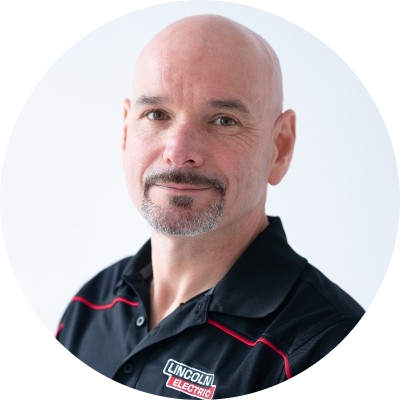{.advisor-photo width=80%}

{.advisor-photo width=80%}

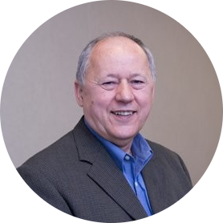{.advisor-photo width=80%}

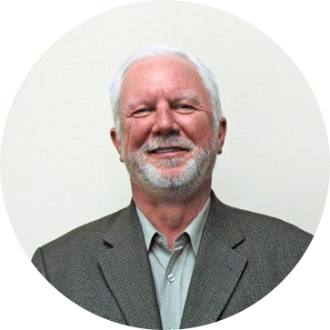{.advisor-photo width=80%}

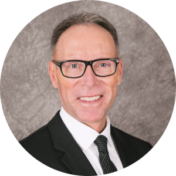{.advisor-photo width=80%}

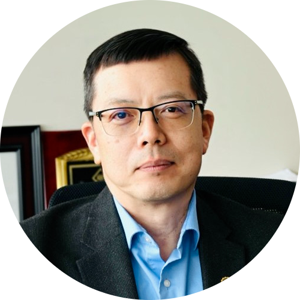{.advisor-photo width=80%}

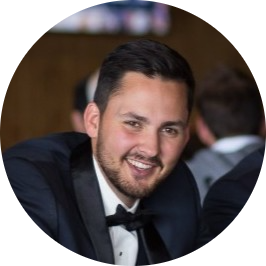{.advisor-photo width=80%}

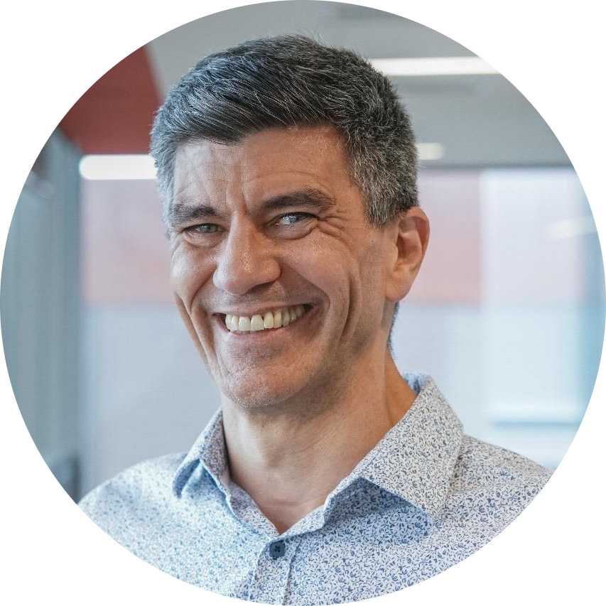{.advisor-photo width=80%}

{.advisor-photo width=80%}

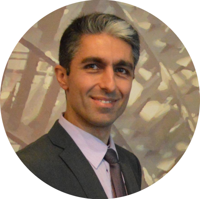{.advisor-photo width=80%}

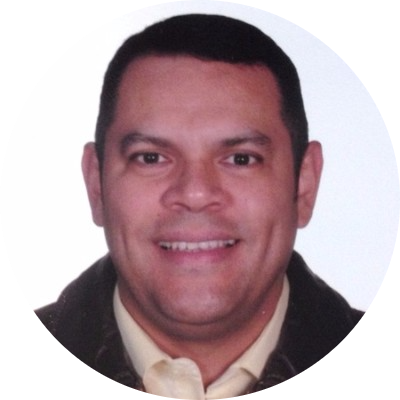{.advisor-photo width=80%}

{.advisor-photo width=80%}

{.advisor-photo width=80%}

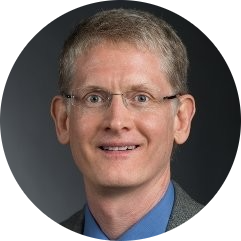{.advisor-photo width=80%}

:::

### Scientific Advisory Board

The CCWJ's research mandate is guided by an interdisciplinary Scientific Advisory Board (SAB). The SAB works to strengthen the interdisciplinary interaction with collaborators, assists researchers in aligning proposals with existing work, and guides the strategic direction of the CCWJ.

 

::: {layout="[[1,1,1,1]]"}

{.advisor-photo width=80%}

{.advisor-photo width=80%}

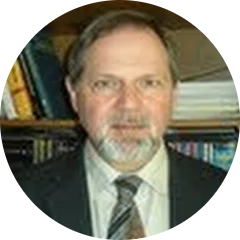{.advisor-photo width=80%}

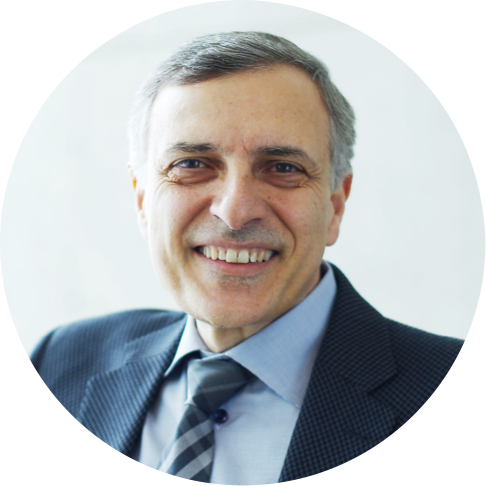{.advisor-photo width=80%}

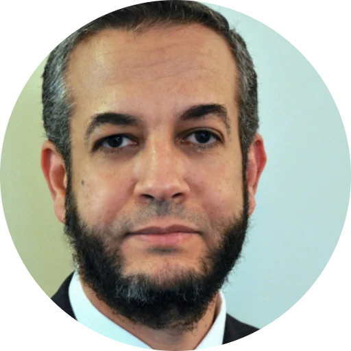{.advisor-photo width=80%}

:::

### Past Members (Industrial Advisory Board)

:::: {.columns}

::: {.column width="50%"}

##### Dr. Gentry Wood
- Apollo Laser Cladding

##### Ivan Gonzalez
- Weldco-Beales

##### Joseph Doria
- Lincoln Electric of Canada

##### Lynn Wyton
- Government of Alberta

##### Michael Whitehead
- Lincoln Electric of Canada

##### Trevor Pond
- Metal Fabricators

##### Dale Malcolm
- Lincoln Electric

##### Darren Lunt
- Weldco Companies

##### Bruce Albrecht
- ITW

:::

::: {.column width="50%"}

##### Dr. Vinay Prasad
- University of Alberta

##### Stefano Chiovelli
- Syncrude

##### Mike MacSween
- Exergy Solutions

##### Michael Anderson
- Becht

##### Gary Topilko
- Weldco-Beales Manufacturing

##### Dale Unrau
- Government of Alberta

:::

::::
