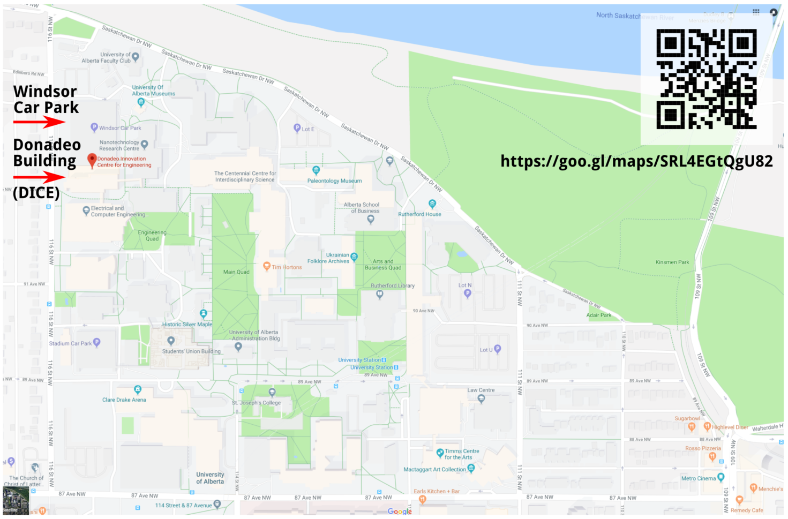
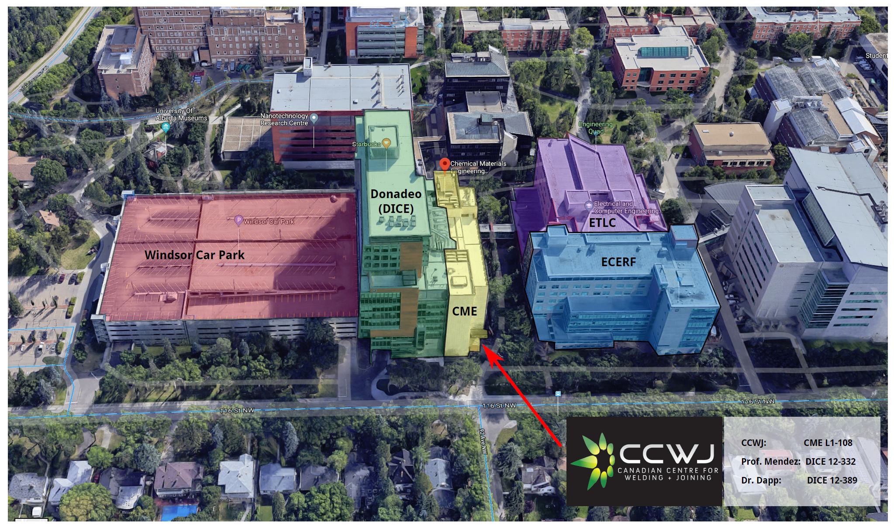

## CCWJ Main Lab

The CCWJ main lab is located in the CME Building on level L1, in room L1-108.

```{python folium-webmap}
#| echo: false
import folium

# create a Map instance
m = folium.Map(location=[53.52830, -113.52956], tiles=None, zoom_start=18)

# add tile layers
folium.TileLayer(
    'https://server.arcgisonline.com/ArcGIS/rest/services/World_Imagery/MapServer/tile/{z}/{y}/{x}', 
    attr='Esri', 
    name='Satellite',
    overlay=False,
    control=True).add_to(m)

folium.TileLayer(
    'http://services.arcgisonline.com/ArcGIS/rest/services/World_Topo_Map/MapServer/tile/{z}/{y}/{x}', 
    attr='Esri', 
    name='Streets',
    overlay=False,
    control=True).add_to(m)

# add layer control to toggle layers
folium.LayerControl(collapsed=False).add_to(m)

# display
m
```



[Google Maps Link](https://goo.gl/maps/eFCG23QcXG8RGnKc7)

If you take the entrance on the South-West side of the building (through the entrance marked in the image below), just go down one flight of stairs, and then straight through the two double doors. Click image for Google StreetView Link.



[Street View Link](https://maps.app.goo.gl/j8y9by5qFWRJJ5m97)

The offices of Prof. Mendez and Dr. Dapp are located in the Donadeo Building. 

[Downloadable Directions (PDF)](https://drive.google.com/file/d/12vO2gIDq0Svm6Pl7AllTEupN3JCTCBsy/view?usp=sharing)

## Parking

Parking is available at Windsor Car Park, which is located directly adjacent to the Donadeo Innovation Centre. There is a direct Pedway connection on Parkade Level 5, which connects to Level 2 at Donadeo (by the elevators).

[GoogleMaps Link](https://goo.gl/maps/8Bw5y9cuMrfUYt1E7)

