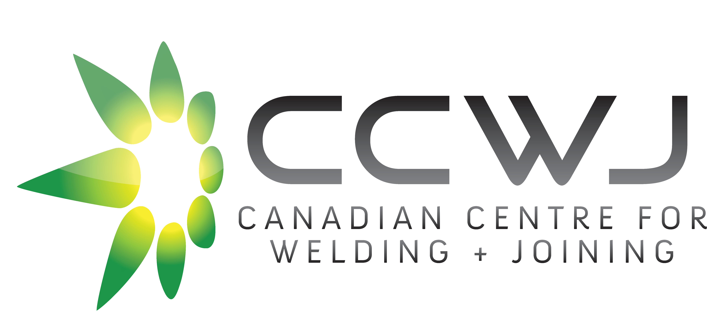

## Advancing Welding and Joining Through Cutting-Edge Research

::: {layout="[ 60, 40 ]"}
:::: {#first-column}
**The Canadian Centre for Welding and Joining** (CCWJ) at the University of Alberta (UofA) is a world-class research and training facility employing researchers at all stages of their career and awarding doctoral degrees through the [Department of Chemical and Materials Engineering at the University of Alberta](https://www.ualberta.ca/en/engineering/chemical-materials-engineering/index.html).

Our mission is to advance interdisciplinary research and share comprehensive expertise in welding, joining, metallurgy, and joining process development. Our research activities focus on everything from fundamentals to applied research, and cover virtually all welding and joining processes in a broad range of material systems.
::::

:::: {#first-column}

::::
:::

## From Science to Industry

The centre addresses the needs of manufacturing, construction, and natural resources sectors in Alberta and Canada. We offer innovation and improvement opportunities for the Alberta metal manufacturing and fabrication sector through programs like the Alberta Metal Fabrication Innovation program (AMFI).

::: {layout="[ [50, 50], [50, 50] ]"}
::::: {.industry}
::::: {style="height:130px"}
The CCWJ has a long track record of working with industry partners globally. Nearly all of its projects are industry-oriented and funded by industry, ensuring that its research has practical applications and benefits for the global manufacturing and construction sectors.
:::::
:::::

::::: {.global}
::::: {style="height:130px"}
The CCWJ collaborates with international researchers and industry partners to exchange welding technologies, host seminars and roundtables with leaders in the welding and manufacturing industries, and lead trade missions at major international events.
:::::
:::::

::::: {.education}
::::: {style="height:130px"}
The CCWJ provides education and training in welding and materials engineering, helping to develop the next generation of experts in the field. Its programs attract students and researchers from around the world, graduating over 55 graduate students.
:::::
:::::

::::: {.startup}
::::: {style="height:130px"}
The CCWJ has backed two successful startups in advanced manufacturing, and through initiatives like the Alberta Metal Fabrication Innovation program (AMFI), the CCWJ supports startups in adopting new technologies and improving their processes.
:::::
:::::
:::

## Research Areas

::: {layout="[ 60, 35 ]"}
:::: {#first-column}
The CCWJ is recognized globally for its cutting-edge research in welding and joining technologies. Over the past decade, our funding support exceeds \$6M.

The research of the CCWJ has historically been centred on steel applications and product development, wear protective overlays, numerical modelling of welding, and laser-based advanced manufacturing. Our results in this area have been published in leading journals including [Acta Materialia](https://doi.org/10.1016/j.actamat.2018.03.050), and [Materials Transactions A](https://doi.org/10.1007/s11661-014-2603-8).

 

- **Welding Processes:** Research on all arc welding processes, resistance spot welding, and laser welding.

- **Material Systems:** Focus on steel applications, wear protective overlays, and laser-based advanced manufacturing.

- **Friction Stir Welding:** Progress towards predictive models and understanding defect formation in this solid-state welding process.

- **Numerical Modelling:** Development of models to predict welding features such as cooling rates, heat-affected zone (HAZ) width, and residual stresses.

- **Automation and AI:** Application of artificial intelligence to quantify metal transfer from high-speed videos and other automation initiatives.
::::

:::: {#second-column}

::::
:::

## Welding Research Lab Capabilities

::: {layout="[ 35, 60 ]"}
:::: {#column-one}

::::

:::: {#column-two}
The CCWJ boasts a range of advanced lab facilities:

**Welding Processes:** All Arc welding processes, resistance spot welding, and laser welding.

**Imaging and Thermal Technologies:** Advanced high-speed imaging and thermal technologies.

**Testing Capabilities:** Instrumented testing, hydrogen testing, and computer assisted hardness mapping.

**Microscopy and Modelling:** Atomic-resolution TEM and computational modelling.
::::
:::

## Learn More About Us

The CCWJ represents a unique place to study welding and materials engineering, and is recognized worldwide through the scope of its interdisciplinary research, state-of-the-art infrastructure, collaboration with industry, and education in welding engineering. The CCWJ is commited to supporting the deepest level of fundamental research into welding and joining processes and procedures, coupled with practical, industry-related and industry-driven applications.

Our research is highly interdisciplinary, spanning metallurgy, heat transfer, fluid mechanics, plasma physics, solid mechanics, computer and mathematical modelling, and health sciences for welding applications.

::: {.highlight-row}
 Learn more about our mission and vision, our research, and what we offer.
:::

 

::: {layout="[ 33, 33, 33 ]"}

:::
