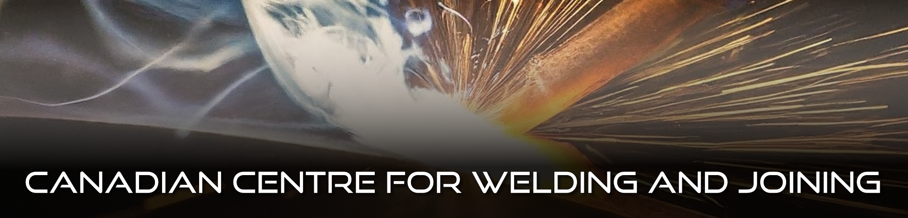
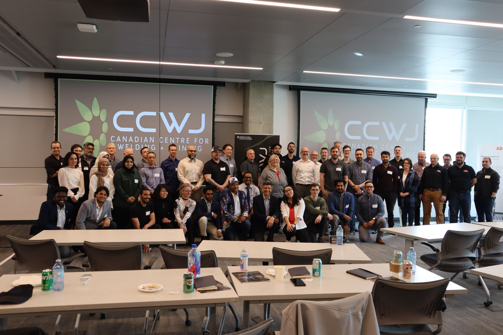
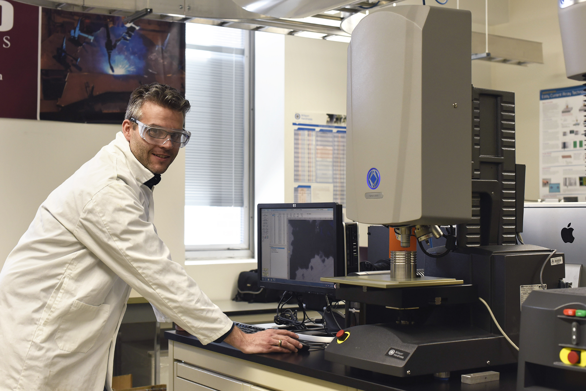

::: {.column-screen}

:::

::: {.column-page}

 

## Advancing welding and joining through cutting-edge research

The Canadian Centre for Welding and Joining (CCWJ) is a \$5M research facility employing researchers at all stages of their career and awarding doctoral degrees through the Department of Chemical and Materials Engineering at the University of Alberta.

Our research has historically been centred on steel applications and product development, wear protective overlays, numerical modelling of welding, and laser-based advanced manufacturing. Our results in this area have been published in leading journals including Acta Materialia, Materials Transactions A. Our funding support in the last 10 years exceeds \$6M, and our experimental facilities include all arc welding processes, resistance spot welding, laser welding, high speed imaging, thermal imaging, instrumented impact testing, computer assisted hardness mapping, hydrogen testing, and more. The centralized facilities at the University of Alberta include characterization facilities reaching atomic-resolution TEM.

 

## Learn more about the CCWJ

 

:::: {.grid}

::: {.g-col-4}

:::

::: {.g-col-4}

:::

::: {.g-col-4}

:::
::::

:::
