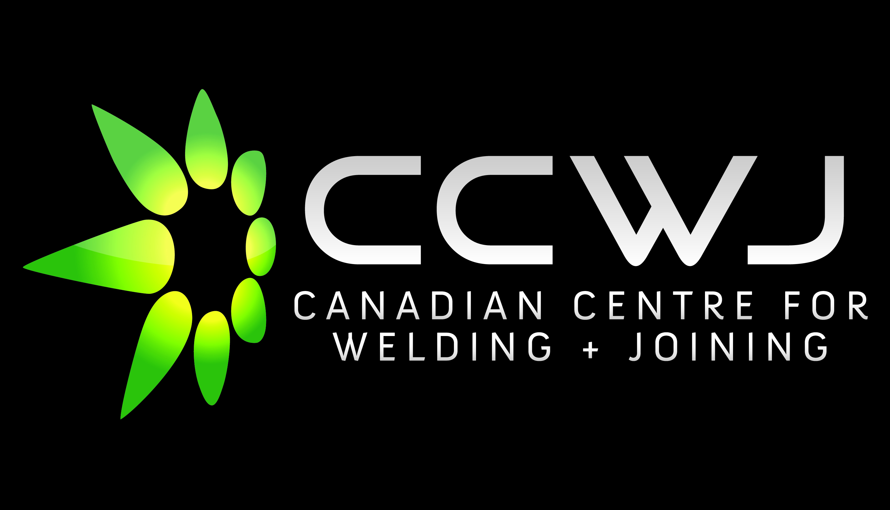
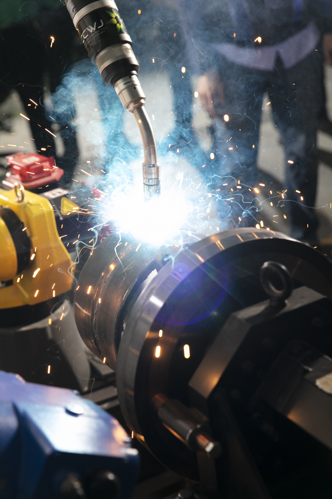
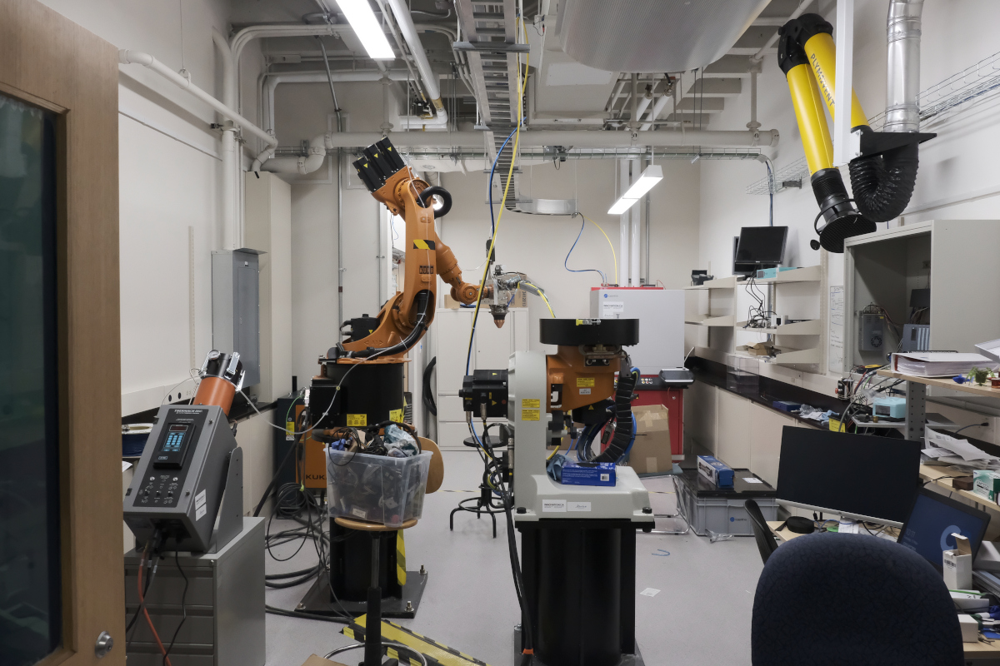
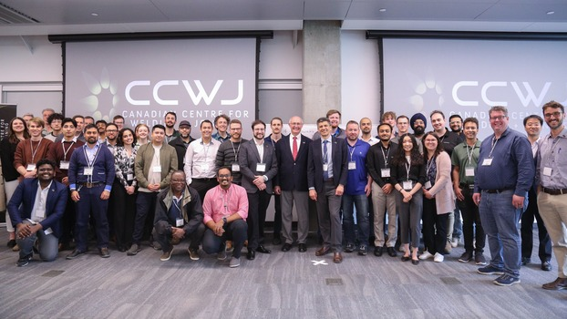
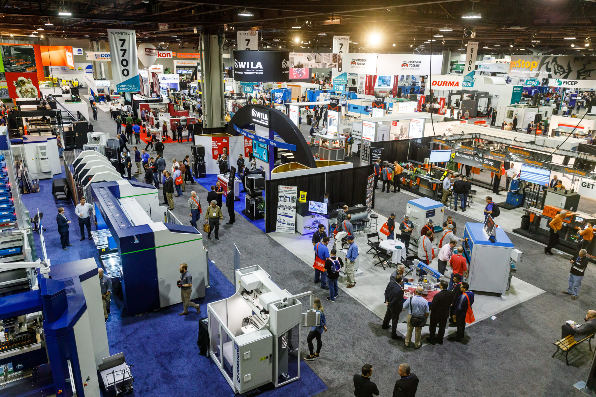

```{=html}
<style>

.video-card{
  text-decoration:none;
  color:inherit;
  display:block;
}

.video-wrapper{
  width:100%;
  height:250px;
  overflow:hidden;
  border-radius:4px;
}

.video-wrapper video{
  width:100%;
  height:100%;
  object-fit:cover;
  display:block;
}

.video-caption{
  margin-top: .4rem;
  font-size: 0.95rem;
  opacity: 0.9;
}

/* Floating right-side conference card */
.hlbw-card{
  position: fixed;
  right: 3px;
  bottom: 0;
  width: 350px;

  /* match navbar/dropdown vibe (dark, clean) */
  background: linear-gradient(180deg, #2b333b 0%, #1b232b 100%);

  border-radius: 14px;
  overflow: hidden;
  box-shadow: 0 20px 50px rgba(0,0,0,0.45);
  border: 1px solid rgba(255,255,255,0.10);
  z-index: 999;
}

.hlbw-card img{
  width:100%;
  display:block;
}

.hlbw-close{
  position:absolute;
  top:8px;
  right:10px;
  background:rgba(0,0,0,0.55);
  color:#fff;
  border:none;
  font-size:16px;
  cursor:pointer;
  border-radius:50%;
  width:26px;
  height:26px;
  line-height:26px;
}

.hlbw-content{
  padding: 12px 14px 8px 14px;  /* smaller bottom padding */
  color: #e6e6e6;              /* softer white */
}

.hlbw-title{
  font-size:0.95rem;
  font-weight:600;
  color:#e6e6e6;
}

.hlbw-meta{
  font-size:0.82rem;
  opacity:0.75;
  margin:0 0 8px 0;             /* tighter spacing */
}

/* Buttons (match CCWJ top-bar vibe) */
.hlbw-actions{
  display:flex;
  gap:10px;
}

.hlbw-btn{
  flex:1;
  text-align:center;
  padding:8px 12px;
  border-radius:6px;
  font-size:0.8rem;
  font-weight:700;
  text-decoration:none;
  border:1px solid #ffffff;
  transition: all 0.25s ease;
}

/* REGISTER BUTTON */
.hlbw-register{
  background: linear-gradient(90deg,#1b232b,#24313b);
  color:#ffffff;
  border:1px solid #ffffff;
}

.hlbw-register:hover{
  background: linear-gradient(90deg,#24313b,#1b232b);
}

.hlbw-more{
  background: transparent;
  color:#ffffff;
  border:1px solid #ffffff;
}

.hlbw-more:hover{
  background: rgba(255,255,255,0.08);
}


@media (max-width:1200px){
  .hlbw-card{ display:none; }
}
</style>

<div class="hlbw-card" id="hlbwCard">
  <button class="hlbw-close" onclick="document.getElementById('hlbwCard').style.display='none'">×</button>

  

  <div class="hlbw-content">
    <div class="hlbw-title">International Conference on Handheld Laser Beam Welding 2026</div>
    <div class="hlbw-meta">Registration Open • June 25–26, 2026 • Edmonton, Alberta</div>

    <div class="hlbw-actions">
      <a class="hlbw-btn hlbw-register" href="https://www.ccwjannualseminar.ca/registration">Register</a>
      <a class="hlbw-btn hlbw-more" href="https://www.ccwjannualseminar.ca/">More Info</a>
    </div>
  </div>
</div>

```


::: {layout="[ 54, 46 ]"}
:::: {#first-column}
**The Canadian Centre for Welding and Joining** (CCWJ) at the University of Alberta (UofA) is a world-class research and training facility employing researchers at all stages of their career and awarding doctoral degrees through the [Department of Chemical and Materials Engineering at the University of Alberta](https://www.ualberta.ca/en/engineering/chemical-materials-engineering/index.html).

Our mission is to advance interdisciplinary research and share comprehensive expertise in welding, joining, metallurgy, and joining process development. Our research activities focus on everything from fundamentals to applied research, and cover virtually all welding and joining processes in a broad range of material systems.
::::

:::: {#first-column}

::::
:::

## From Science to Industry

The centre addresses the needs of manufacturing, construction, and natural resources sectors in Alberta and Canada. We offer innovation and improvement opportunities for the Alberta metal manufacturing and fabrication sector through programs like the Alberta Metal Fabrication Innovation program (AMFI). Our work is organized around four core pillars:



::: {.highlight-row}
::: {.highlight-row-content}

## Research

::: {layout="[ 60, 28 ]"}
:::: {#first-column}
The CCWJ is recognized globally for its cutting-edge research in welding and joining technologies. Over the past decade, our funding support exceeds \$6M.

Our research has historically been centred on steel applications and product development, wear protective overlays, numerical modelling of welding, and laser-based advanced manufacturing. Our results in this area have been published in leading journals including [Acta Materialia](https://doi.org/10.1016/j.actamat.2018.03.050), and [Materials Transactions A](https://doi.org/10.1007/s11661-014-2603-8).

Our current research themes include:

- **Welding Processes:** Research on all arc welding processes, resistance spot welding, and laser welding.

- **Material Systems:** Focus on steel applications, wear protective overlays, and laser-based advanced manufacturing.

- **Friction Stir Welding:** Progress towards predictive models and understanding defect formation in this solid-state welding process.

- **Numerical Modelling:** Development of models to predict welding features such as cooling rates, heat-affected zone (HAZ) width, and residual stresses.

- **Automation and AI:** Application of artificial intelligence to quantify metal transfer from high-speed videos and other automation initiatives.
::::

:::: {#second-column}

::::
:::
:::
:::

## Welding Research Lab Capabilities

::: {layout="[ 40, 60 ]"}
:::: {#column-one}
[](about/lab.qmd){fig-alt="The CCWJ laser welding laboratory"}
::::

:::: {#column-two}
The CCWJ boasts state-of-the-art welding equipment, advanced diagnostic tools, comprehensive characterization tools, and sophisticated modeling software:

- **Welding Equipment:** Arc welding, laser welding, and robotic welding systems.

- **Diagnostic Tools:** High-speed cameras, laser lighting, specialized thermal cameras, wavelength spectrometers, and data acquisition systems.

- **Characterization Tools:** Hardness mapping, surface profilometry, instrumented impact testing, hydrogen, oxygen, and nitrogen testing.

- **Modeling Software:** Weld modeling software like VRWeld, Simufact, and Transweld, as well as general-purpose modeling software like Comsol and Matlab.
::::
:::

::: {.highlight-row}
::: {.highlight-row-content}

## Learn More About Us

The CCWJ represents a unique place to study welding and materials engineering, and is recognized worldwide through the scope of its interdisciplinary research, state-of-the-art infrastructure, collaboration with industry, and education in welding engineering. The CCWJ is committed to supporting the deepest level of fundamental research into welding and joining processes and procedures, coupled with practical, industry-related and industry-driven applications.

Our research is highly interdisciplinary, spanning metallurgy, heat transfer, fluid mechanics, plasma physics, solid mechanics, computer and mathematical modelling, and health sciences for welding applications. Explore more about us, our research, and what we offer:

::: {layout="[ 33, 33, 33 ]"}
[](about/about.qmd){fig-alt="CCWJ seminar series."}

```{=html}
<a href="research/research.qmd" class="video-card">
  <div class="video-wrapper">
    <video autoplay muted loop playsinline preload="metadata">
      <source src="assets/Our%20Research.mp4" type="video/mp4">
    </video>
  </div>
  <p class="video-caption">Our Research</p>
</a>
```

[](about/what-we-do.qmd){fig-alt="Trade event."}
:::
:::
:::
